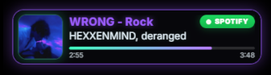
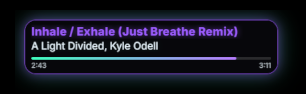
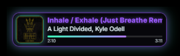

# Haven Spotify Overlay


A ready-to-import overlay setup for [Haven Spotify Integration](https://github.com/CathieNova/Firebot-Script-HavenSpotifyIntegration)

This setup gives you a Spotify now playing overlay for Firebot. It includes the Custom Widget, events, preset effect list, and a song request command.

---

## Discussion, Bug Reports & Suggestions

You can discuss everything in [**CrowbarTools Discord**](https://discord.gg/tTmMbrG), bugs can be reported in the [**GitHub Issues**](https://github.com/CathieNova/Firebot-Setup-HavenSpotifyIntegrationOverlay/issues), and suggestions for improvements are always welcome in both places.

---

## Showcase






---

## What gets added

### Spotify Thumbnail

This is the Custom Widget that shows the Spotify overlay on stream.

### Spotify Update Widget

This is the preset effect list that sends Spotify data to the overlay.

### !songrequest

A simple command viewers can use to request a song.

NOTE: You can add this to a Channel Point Redemption or Power-Up instead of using a command.

---

## Events included

| Event                          | What it does                                                                                           |
|--------------------------------|--------------------------------------------------------------------------------------------------------|
| Spotify Playback Paused        | Used when Spotify is paused. The overlay can either show Paused or hide.                               |
| Spotify Playback Resumed       | Updates the overlay when Spotify starts playing again.                                                 |
| Spotify Song Changed           | Updates the overlay when the current song changes.                                                     |
| Spotify Track Progress Changed | Updates the progress bar when Spotify playtime changes or jumps.                                       |
| Spotify Song Added To Queue    | Runs when a song request is added to the queue.                                                        |
| Custom Widget Message Received | Lets the overlay ask Firebot for the current Spotify song again when OBS refreshes the browser source. |

---

## How the overlay gets updated

The overlay listens for this message:

`spotify-update`

That message sends the song data to the widget.

Example:

```json
{
    "song": "$spotifySong",
    "artist": "$spotifyArtist",
    "album": "$spotifyAlbum",
    "trackUrl": "$spotifyTrackUrl",
    "trackId": "$spotifyTrackId",
    "isPlaying": "$spotifyIsPlaying",
    "progress": "$spotifyProgress",
    "progressMs": "$spotifyProgressMs",
    "duration": "$spotifyDuration",
    "durationMs": "$spotifyDurationMs",
    "deviceName": "$spotifyDeviceName",
    "volume": "$spotifyVolume",
    "requester": "$spotifyCurrentRequesterDisplayName",
    "showRequester": true,
    "settings": {
        "anchorPosition": "top-left",
        "xOffsetToAnchor": 15,
        "yOffsetToAnchor": 15,

        "scaleMultiplier": 1.0,
        "cardMaxWidthPx": 400,

        "showThumbnail": true,
        "thumbnailScale": 1.1,
        "thumbnailGlow": true,
        "thumbnailOffsetToLeft": -2.5,

        "showStatusPill": true,
        "showPausedPill": true,

        "showGlow": true,
        "requestCooldownMs": 5000,

        "text": {
            "songOverflow": "scroll",
            "artistOverflow": "scroll",
            "scrollSpeedPxPerSecond": 35
        },

        "style": {
            "background": "rgba(10,10,16,0.70)",
            "borderColor": "rgba(156,92,255,0.70)",
            "nameFallbackColor": "#9C5CFF",
            "textColor": "#EAF7FF",
            "progressStartColor": "#40FFC0",
            "progressEndColor": "#b77dff",
            "cardGlowColor": "rgba(156,92,255,0.45)",
            "thumbnailGlowColor": "rgba(64,255,192,0.30)"
        }
    }
}
```

You normally do not need to edit the Spotify variables.

Edit the values inside `settings` if you want to change how the overlay looks or behaves.

Colors can use [rgba(...)](https://rgbacolorpicker.com/) or [Hex](https://www.w3schools.com/colors/colors_picker.asp) colors.

---

## Useful settings

### Layout

| Setting           | What it does                                                                                                                                                                |
|-------------------|-----------------------------------------------------------------------------------------------------------------------------------------------------------------------------|
| `anchorPosition`  | Where the overlay sits. Supports `top-left`, `top-center`, `top-right`, `middle-left`, `middle-center`, `middle-right`, `bottom-left`, `bottom-center`, and `bottom-right`. |
| `xOffsetToAnchor` | Horizontal spacing from the selected anchor position, in pixels.                                                                                                            |
| `yOffsetToAnchor` | Vertical spacing from the selected anchor position, in pixels.                                                                                                              |
| `scaleMultiplier` | Scales the whole overlay. `1.0` is normal size.                                                                                                                             |
| `cardMaxWidthPx`  | Maximum width of the overlay card.                                                                                                                                          |

### Thumbnail

| Setting                 | What it does                                                             |
|-------------------------|--------------------------------------------------------------------------|
| `showThumbnail`         | Shows or hides the album art. If disabled, thumbnails are not looked up. |
| `thumbnailScale`        | Changes the album art size.                                              |
| `thumbnailGlow`         | Turns the album art glow on or off.                                      |
| `thumbnailOffsetToLeft` | Moves the album art left or right. Lower values move it left.            |

### Pills and glow

| Setting          | What it does                                                  |
|------------------|---------------------------------------------------------------|
| `showStatusPill` | Shows or hides the green Spotify pill while music is playing. |
| `showPausedPill` | Shows or hides the Paused pill when Spotify is paused.        |
| `showGlow`       | Turns the main card glow on or off.                           |

### Text

| Setting                  | What it does                                                 |
|--------------------------|--------------------------------------------------------------|
| `songOverflow`           | Use `truncate` or `scroll` for long song names.              |
| `artistOverflow`         | Use `truncate` or `scroll` for long artist names.            |
| `scrollSpeedPxPerSecond` | How fast long text scrolls when overflow is set to `scroll`. |

### Updates

| Setting             | What it does                                                                                |
|---------------------|---------------------------------------------------------------------------------------------|
| `requestCooldownMs` | Limits how often the widget asks Firebot for current Spotify data. Helps avoid rate limits. |

### Style

| Setting              | What it changes                                      |
|----------------------|------------------------------------------------------|
| `background`         | Main card background color.                          |
| `borderColor`        | Card border color.                                   |
| `nameFallbackColor`  | Song title and requester name color.                 |
| `textColor`          | Artist, time, requester text, and normal text color. |
| `progressStartColor` | First color of the progress bar.                     |
| `progressEndColor`   | Second color of the progress bar.                    |
| `cardGlowColor`      | Glow color around the main card.                     |
| `thumbnailGlowColor` | Glow color around the album art.                     |

---

## Pause data

The pause event sends this message:

`spotify-hide`

To show the paused state:

```json
{
    "allowPaused": true,
    "pausedText": "Paused"
}
```

To fully hide the overlay instead:

```json
{
    "allowPaused": false
}
```

If `showPausedPill` is disabled, the overlay can still stay visible while paused, but the Paused pill will not show.

---

## Good to know

- [Haven Spotify Integration](https://github.com/CathieNova/Firebot-Script-HavenSpotifyIntegration) must be installed and linked to Spotify first.
- If the overlay does not update, relink Spotify in Firebot.
- If OBS refreshes the browser source, the overlay asks Firebot for the current song again.
- The widget uses a cooldown so it does not ask Firebot for current Spotify data too often.
- Thumbnails are cached and only looked up when `showThumbnail` is enabled.
- If you drag the Spotify playtime manually, the progress bar updates when the plugin sends the next progress update.
